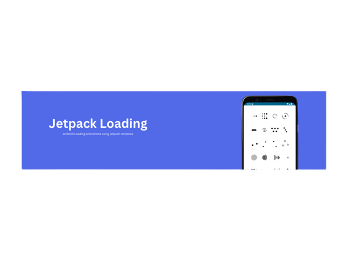
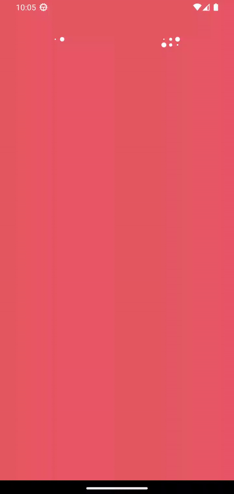

# JetpackLoading

In almost all applications, there are processes that run asynchronously, such as API requests or long-running tasks. In these cases, developers usually use the loading view to show users that something is in progress.
JetpackLoading is a collection of nice loading animations in Jetpack Compose, adapted from the famous [AVLoadingIndicatorView](https://github.com/HarlonWang/AVLoadingIndicatorView) library.

See the animations in the demo section and their use in 


## Demo


## Usage

- #### Step 1
  Add it in your root build.gradle:
  
  ```bash
  allprojects {
    repositories {
      ...
      maven { url 'https://jitpack.io' }
    }
  }
  
   
- #### Step 2
  Add the dependency
  
  ```bash
  dependencies {
		  implementation 'com.github.User:Repo:Tag'
  }
  
   
- #### Step 3  
  It's very simple to use. Just add component where you want
  ```bash
   @Composable
   fun Greeting() {
       ...
       PacmanIndicator()
       ...
   }
  ```
  
  You can also control the details of the animations using parameters
  ```bash
   @Composable
   fun Greeting() {
       ...
       PacmanIndicator(color = Color.Black, ballDiameter = 60f, canvasSize = 60.dp, animationDuration = 1000)
       ...
   }
  ```

Enjoy JetpackLoading 😊
  
##  Indicators

The indicators are as follows:

Row 1
 - `PulsatingDot`
 - `GridPulsatingDot`
 - `CircularPulsatingIndicator`
 - `BallClipRotatePulseIndicator`

 Row 2
 - `SquareSpinIndicator`
 - `BallClipRotateMultipleIndicator`
 - `BallPulseRiseIndicator`
 - `BallRotateIndicator`

  Row 3
 - `CubeTransitionIndicator`
 - `BallZigZagIndicator`
 - `BallZigZagDeflectIndicator`
 - `BallTrianglePathIndicator`

Row 4
 - `BallScaleIndicator`
 - `LineScaleIndicator`
 - `LineScaleIndicator`
 - `BallScaleMultipleIndicator`

Row 5
 - `BallPulseSyncIndicator`
 - `BallBeatIndicator`
 - `LineScaleIndicator`
 - `LineScaleIndicator`

 Row 6
 - `BallScaleRippleIndicator`
 - `BallScaleRippleMultipleIndicator`
 - `BallSpinFadeLoaderIndicator`
 - `LineSpinFadeLoaderIndicator`

  Row 7
 - `TriangleSpinIndicator`
 - `PacmanIndicator`
 - `BallGridBeatIndicator`
 - `SemiCircleSpinIndicator`


## 🔗 Contact
[](https://www.linkedin.com/in/mahboubehseyedpour)

[](mailto:https://www.linkedin.com/in/mahboubehseyedpour)
